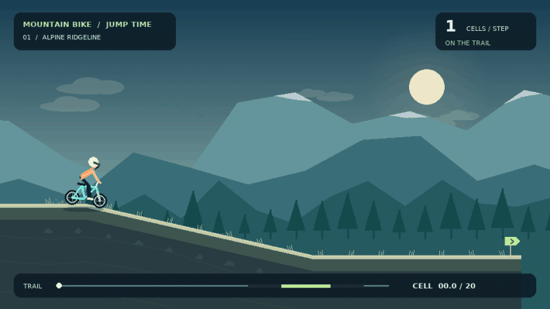

# mountain-bike-jump-time

<p align="center">
  <picture>
    <source
      media="(prefers-color-scheme: dark)"
      srcset="/assets/images/mountain_bike_hero_dark.png"
    >
    
  </picture>
</p>

A toy [Farama Gymnasium](https://gymnasium.farama.org/) environment: a stochastic *jump-timing* problem in the
spirit of "optimal start" problem with random latent environment configuration that can be fully enumerated for true policy value computation.

A bike rides along a 1-D track and must decide *when* to jump in order to land on a small target platform surrounded by two gaps. The agent only controls the binary action `{0: continue, 1: jump}`; the first `1` is an irreversible switch action. Bike speed evolves according to the local slope.

<p align="center">
  <picture>
    
  </picture>
</p>

This environment can be useful for **Off-Policy Evaluation (OPE)** estimators evaluation: the latent randomness is *finite and discrete*, which makes the true value of any policy `V(π) = Σ_ω p(ω) · G(π, ω)` exactly computable by enumeration, ideal for benchmarking IS / DM / hybrid OPE estimators.

Developping and validating OPE estimators on real-world data can be difficult. Main advantages of this toy env are:

- **Exact ground truth**: a toy environment allows exact computation of true policy value, making estimator bias and error directly measurable.
- **Controlled complexity**: stochasticity, partial observability, support mismatch, reward shape, and policy overlap can be varied independently.
- **Always known behavior policy**: action probabilities and logging mechanisms are fully known, avoiding ambiguity from schedules, overrides, and hidden logic.
- **Fast reproducible experiments**: many independent datasets can be generated with fixed seeds to measure bias, variance, MSE, and confidence interval behavior.
- **Clear failure analysis**: estimator failures are easier to isolate, visualize, and explain because the latent dynamics, counterfactuals, and reward components are known.

Note: this environment was developped as a way to test custom estimators developped in the [Triggy](https://triggy.foobot.io) project. Jump time problem was framed as close as possible to optimal start time problem.

## Install

Requires **Python 3.12**.

```bash
poetry install
```

## Usage

```python
import gymnasium as gym
import mountain_bike_jump_time  # registers MountainBikeJump-v0

env = gym.make("MountainBikeJump-v0")
obs, info = env.reset(seed=0)

done = False
while not done:
    obs, reward, terminated, truncated, info = env.step(env.action_space.sample())
    done = terminated or truncated

print(info["reward_components"])
```

### Computing the exact value of a policy

```python
from mountain_bike_jump_time import MountainBikeJumpEnv
from mountain_bike_jump_time.rollout import return_for

env = MountainBikeJumpEnv()

# Enumerate all latent environment configurations and compute policy value
# Switch-time policy: always jump at u = 3.
value = sum(p * return_for(omega, switch_time=3)
            for omega, p in env.enumerate_latents())
```

### Visualizing a rollout

The Pygame renderer draws a stylized mountain-bike landscape at **30 FPS**:

For fun:

- Three procedural themes: **alpine**, **desert**, and **dusk**, with seeded variation.
- Layered mountain parallax, forests/cacti, moving clouds, birds, stars, and waving flags.
- A tracking camera, articulated rider, rotating wheels, pedaling, dust, and landing compression.
- Real gaps and a highlighted landing platform, with distinct success and fall animations.
- A compact speed/progress/reward HUD; optional agent-visibility and trajectory overlays.



Try it immediately from the project root (after installing the project dependencies):

```bash
poetry run python -m mountain_bike_jump_time.demo --theme alpine --output episode.gif
poetry run python -m mountain_bike_jump_time.demo --never-jump --output fall.gif
```

The demo enumerates jump times and chooses the highest-return one for its track (not based on a trained policy).
Some tracks cannot be successfully jumped. Override with `--jump-step 0` or `--never-jump` to inspect failures.

#### Gym rendering

Gym uses the scenic Pygame renderer by default.

```python
import gymnasium as gym
import mountain_bike_jump_time
from mountain_bike_jump_time import RenderConfig

env = gym.make(
    "MountainBikeJump-v0",
    render_mode="human",  # or "rgb_array" for headless frames
    render_config=RenderConfig(theme="auto", seed=42, show_debug=False),
)
obs, info = env.reset(seed=0)
try:
    done = False
    while not done:
        obs, reward, terminated, truncated, info = env.step(env.action_space.sample())
        done = terminated or truncated
finally:
    env.close()
```

Pass `renderer="matplotlib"` to retain the original diagnostic Gym view.

#### Episode replay and export

`render_episode()` uses **matplotlib default** for static PNG exports and evaluation code.
Select `renderer="pygame"` for the animated scenery.
Use `.gif` for full animation, `.png` for a final still, or `mode="human"` for playback. An RGB-only call renders just the final frame.

```python
from mountain_bike_jump_time import RenderConfig, render_episode

render_episode(
    latent=env.unwrapped.latent,
    config=env.unwrapped.config,
    slope_per_cell=env.unwrapped._slope_per_cell,
    trajectory=env.unwrapped.trajectory,
    jump_time=env.unwrapped._jump_time,
    landing_position=env.unwrapped._landing_position,
    reward_components=env.unwrapped.reward_components,
    renderer="pygame",
    render_config=RenderConfig(
        theme="alpine", seed=42, width=960, height=540, fps=30,
        show_hud=True, show_debug=False, step_seconds=0.32, hold_seconds=0.9,
    ),
    save_path="rollout.gif",
)
```

The training CLI's existing `--viz-renderer pygame` option also uses the enhanced
renderer, with automatic scenery. Prefer `--viz-best --viz-worst` for quick visual
checks; exporting every enumerated episode as an animation is much more expensive.

With `theme="auto"` and `seed=None`, the latent configuration determines both the
theme and scenery. Theme and scenery have no impact on the dynamics or reward.

### Training a PPO policy with Ray RLlib

A small end-to-end training + evaluation example using Ray RLlib's new API
stack (PPO on torch) is provided:

```bash
poetry run python -m mountain_bike_jump_time.train_ppo --iterations 20
```

The script trains a PPO policy on `MountainBikeJump-v0`, then evaluates it
both empirically (greedy rollouts) and *exactly* by enumerating the finite
discrete latent space:

```python
from mountain_bike_jump_time.train_ppo import train_and_evaluate

result = train_and_evaluate(iterations=20, eval_episodes=50)
print(result["eval_stats"]["mean_return"])
print(result["exact_policy_value"])  # V(π) via latent enumeration
```

## Test

```bash
poetry run pytest
```
